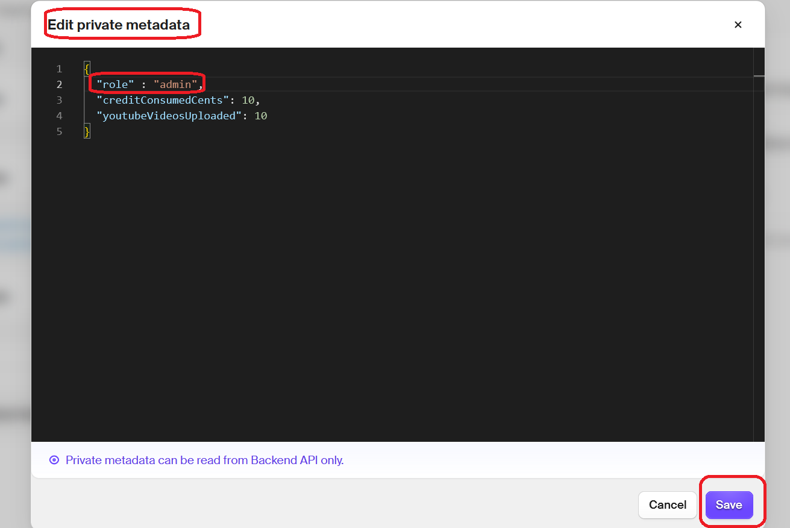
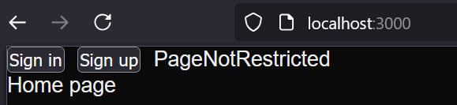
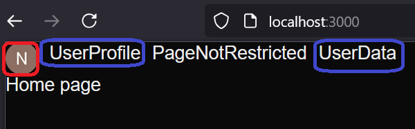
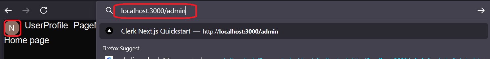
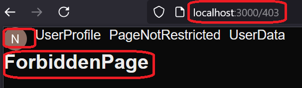

<h1>todo</h1>
- do not allow call function if consume more than allowed

<h1>Project Name</h1>
....

<h2>Project Description</h2>
....

<h2>Motivation</h2>
in post2video i have open ai key which is share by all users. currently i am working on the free tier and i want to allow each user on the free tier to have up to 6 video upload to youtube and consume no more than 20 cents (later there will be payed tier so things will be more complex) - so how to do it ?

minimally you need the following :

- collect video uploads and api consumption per user
- once limit reach notify and do not allow to enter specific pages

<h2>Installation</h2>

follow <a href='#ref1'>[1]</a> for creating the project skeleton

<h3>admin role</h3>
I have create the admin role from the dashboard
follow this image 

<h2>Usage</h2>
....

<h2>Technologies Used</h2>
<ul>
<li>clerk</li>
<li>next.js app router</li>
</ul>

<h2>Design</h2>
questions
<ol>
<li>can i come with generic design</li>
<li>does design involve ui </li>
<li>does it involve the user management (check <a href='https://github.com/NathanKr/post2video-user-management'>post2video-user-management</a>) i.e. clerk</li>
<li>if clerk is part of the design ---> can i use role for better design</li>

</ol>

gemini answers :
In summary:

<ol>
    <li>Start with a generic design for the core logic of tracking, enforcing, notifying, and blocking</li>
    <li>The initial design doesn't need to include UI details, but you should consider how the UI will eventually interact with the backend</li>
    <li>Your design must integrate with your user management system (Clerk) to associate usage with specific users</li>
    <li>Leveraging roles in Clerk is a highly recommended approach for a cleaner, more scalable design, especially when considering future paid tiers and potentially different limits</li>
</ol>

More questions

<h3>how to not show restricted tabs - e.g. admin</h3>
done with static layout.tsx becaus new login will cause redirect to page and re-render layout

```tsx
{user && isAdmin(user) && <Link href={PageUrl.Admin}>Admin</Link>}
```

but protected with middleware

```ts
    if (isAdminRoute(req)) {
      const user = await client.users.getUser(userId!);
      if (!isAdmin(user)) {
        return NextResponse.redirect(new URL("/403", req.url));
      }
    }

```


<h3>create user private metadata after success signup</h3>
options :
<ul>
<li> webhooks - after event user.created</li>
<li> after signup page - redirect to specific page</li>
<li> userId exist but data is null - so first time you see it create user private data</li>
</ul>

seems that after signup page (SignupSuccessPage) is a good start because its simple and i have the context of new user

<h3>after signup page</h3>
<h4>Q how to navigate to it</h4>

add props

```tsx
<SignUpButton forceRedirectUrl={PageUrl.SignUpSuccess}/>
```

<h4>Q how to implement it</h4

Create a new page in your app directory (e.g., app/signup/success/page.tsx).
Within this page, implement the client-side component (AfterSignupHandler) that uses the useClerk() hook and the useEffect to check for isSignedIn and isUserLoaded and then trigger your initializeUserPrivateMetadata Server Action.>


<h3>do i need clerk role or use privateData\publicData role property</h3>
roles seems way too complicated for me because in clerk role has permission but i dont need permissions just role name : admin , free-tier, .... so i think that role member in private data is enough

<h3>can i protect pages via midleware only</h3>
seems so via clerkMiddleware


<h3>page level resource</h3>
can resource i am protecting be on page level ?

Yes, absolutely! When we talk about protecting "resources" with role-based access control (RBAC), a page in your Next.js application is a very common and fundamental type of resource that you'll want to secure.

Think of it this way:`

Resource: Anything in your application that you want to control access to. This can be data, functionality, or specific parts of the user interface.
Page: A specific URL or view in your web application

<h3>choose roles</h3>
Q : user can be in one of these state : admin , not registred ,registred (free tier,free tier expired , payed program , payed program expired) does every state is a role

A : not neceseraly, I've identified three primary roles based on the fundamental levels of access and responsibilities:

<ul>
    <li>Admin: Full control and management capabilities</li>
    <li>Free Tier: Basic access and permissions granted to registered users without a paid subscription</li>
    <li>Paid Tier: Enhanced access and permissions associated with users who have a paid subscription.
</ul>

Then, for the states like "free tier expired" and "paid program expired," we'd use user metadata within Clerk to track those temporary statuses. Your application logic would then consider both the user's role and their metadata to determine their current level of access and the features available to them.

Not registerd will give null user so no need for user because here user must be registered

<h2>Code Structure</h2>
....

<h3>clerkMiddleware</h3>

clerkMiddleware is used to protect pages it is perfectly situated between the client and the server

```ts
const isPublicRoute = createRouteMatcher([
  PageUrl.Home,
  PageUrl.PageNotRestricted,
]);
const isAdminRoute = createRouteMatcher([PageUrl.Admin]);

export default clerkMiddleware(async (auth, req) => {
  if (!isPublicRoute(req)) {
    await auth.protect(); // -- if not login redirect to sign in otherwise contine

    // --- come here means user is logged in
    const { userId } = await auth();
    const client = await clerkClient();

    if (isAdminRoute(req)) {
      const user = await client.users.getUser(userId!); // userId can not be null after auth.protect()
      if (!isAdmin(user)) {
        return NextResponse.redirect(new URL("/403", req.url));
      }
    }
  }
});

export const config = {
  matcher: [
    // Skip Next.js internals and all static files, unless found in search params
    "/((?!_next|[^?]*\\.(?:html?|css|js(?!on)|jpe?g|webp|png|gif|svg|ttf|woff2?|ico|csv|docx?|xlsx?|zip|webmanifest)).*)",
    // Always run for API routes
    "/(api|trpc)(.*)",
  ],
};
```

<h3>RootLayout</h3>

RootLayout is server component !!!

```tsx

export default async function RootLayout({
  children,
}: Readonly<{
  children: React.ReactNode;
}>) {

  const user = await currentUser();

  return (
    <ClerkProvider>
      <html lang="en">
        <body
          className={`${geistSans.variable} ${geistMono.variable} antialiased`}
        >
          <header style={{display:'flex' , gap:'10px'}}>
            <SignedOut>
              <SignInButton />
              <SignUpButton forceRedirectUrl={PageUrl.SignUpSuccess}/>
            </SignedOut>
            <SignedIn>
              <UserButton />
            </SignedIn>
            {user && <Link href={PageUrl.UserProfile}>UserProfile</Link>}
            <Link href={PageUrl.PageNotRestricted}>PageNotRestricted</Link>
            {user && <Link href={PageUrl.UserData}>UserData</Link>}
            {user && isAdmin(user) && <Link href={PageUrl.Admin}>Admin</Link>}
          </header>
          {children}
        </body>
      </html>
    </ClerkProvider>
  );
}
```

<h3>SignupSuccessPage</h3>

```tsx
export default async function SignupSuccessPage() {

  await initializeSignupSuccessUserAsFreeTier()

  return <p>Signup is success , you can start your free tier</p>;
}
```


<h2>Demo</h2>

<h3>user not logged in</h3>
Only Home and PageNotRestricted tabs are shown. 
Sign in and Sign up buttons are shown so he can authenticated 




<h3>non admin user logged in</h3>
Tabs UserProfile and UserData are shown
The user can sign out by click on the red circled image



<h3>admin user logged in</h3>
Tab Admin is shown on top of regular logged in user


<h3>non admin user try admin page</h3>

altough not shown may be he guess the admin url



The url pass via the midleware which navigate it to 403 page



<h2>Points of Interest</h2>
<ul>
    <li>the design of the roles \ permission is nice because i am able to complete it fully on the server side via middleware.ts and layout.tsx which is server component</li>
</ul>

<h2>open issues</h2>
<ul>
    <li>i am not navigating to /signup/success on click on button signup even though i have CLERK_SIGN_UP_REDIRECT_URL=/signup/success in .env.local. however, using the prop forceRedirectUrl is working on SignUpButton</li>
</ul>


<h2>References</h2>
<ol>
<li id='ref1'><a href='https://youtu.be/5zE_c5kDDDs?si=qwxnm54ILEVbTYR6'> Seamless User Management with Clerk and Next.js </a></li>
</ol>
