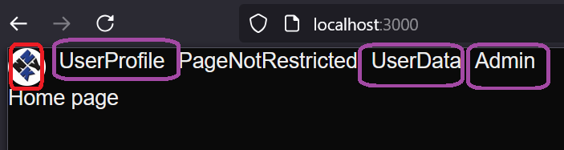

<h1>Project Name</h1>
User Management with Roles via Clerk

<h2>Project Description</h2>
<p>This project demonstrates how to implement user management with role-based access control (RBAC) in a Next.js App Router application using Clerk. It addresses the problem of managing user roles (e.g., admin, free-tier, and paid-tier) and their access permissions, particularly when dealing with shared resources like OpenAI keys.</p>

<h2>Motivation</h2>
<p>In <b>post2video</b>, an OpenAI key is shared by all users. This project explores how to manage access to this and other resources by implementing different user tiers (free, paid) and administrative roles. While Clerk handles authentication (user login), this project focuses on <b>authorization</b>: what each logged-in user is allowed to do within <b>post2video</b>. Role-based access control (RBAC) provides a clean solution, and this project demonstrates how to implement it with Clerk and Next.js App Router. The authentication part is described in <a href="#ref1">[Seamless User Management with Clerk and Next.js]</a>.</p>


<h2>Installation</h2>
<p>Follow the instructions in <a href="#ref1">[Seamless User Management with Clerk and Next.js]</a> for creating the project skeleton.</p>

<h3>Admin Role Setup</h3>
<p>The admin role is created from the Clerk dashboard. See the image below:</p>
Usage</h2>

Run the devlopment server

```bash
npm run dev
```

<h2>Technologies Used</h2>
    <ul>
        <li>clerk</li>
        <li>next.js app router</li>
        <li>zod</li>
        <li>typescript</li>
</ul>


<h2>Design</h2>
<p>The core design of this project revolves around implementing role-based access control (RBAC) to manage different user tiers (e.g., free-tier, paid-tier) and administrative privileges within <b>post2video</b>. We leverage Clerk for authentication and then implement authorization logic based on user roles. The key design decisions are detailed below:</p>

<h3>How to Restrict Access to Tabs (e.g., Admin)</h3>

<p>We use a combination of server-side and client-side logic to restrict access to certain parts of the UI within <b>post2video</b> (e.g., the admin tab).</p>

<b>Server-Side (Layout):</b> In <code>layout.tsx</code> (a server component), we conditionally render the admin tab link based on the user's role:

```tsx
{
  user && isAdmin(user) && <Link href={PageUrl.Admin}>Admin</Link>;
}
```
<p>This prevents unauthorized users from even seeing the link within <b>post2video</b>. Because <code>layout.tsx</code> is a server component, this check occurs before the page is sent to the browser.</p>

<b>Middleware:</b> For robust protection, we also use middleware to prevent users from directly accessing the admin route within <b>post2video</b>, even if they know the URL:

```ts
if (isAdminRoute(req)) {
  const user = await client.users.getUser(userId!);
  if (!isAdmin(user)) {
    return NextResponse.redirect(new URL("/403", req.url));
  }
}
```


<h3>How to Create User Metadata After Signup</h3>
<p>When a user signs up for <b>post2video</b>, we need to assign them an initial role (e.g., "free-tier"). We considered these options:</p>
<ul>
    <li>Webhooks (after the <code>user.created</code> event)</li>
    <li>Redirecting to a specific page after signup</li>
    <li>Checking for null data when a <code>userId</code> exists</li>
</ul>
<p>We chose the "redirect to a specific page" approach (<code>SignupSuccessPage</code>) because it's simple and gives us direct access to the new user's context within <b>post2video</b>.</p>


<h3>Navigating to the Signup Success Page</h3>
<p>To ensure users are redirected to the <code>SignupSuccessPage</code> after signing up for <b>post2video</b>, we use the <code>forceRedirectUrl</code> prop on the <code>SignUpButton</code>:</p>


```tsx
<SignUpButton forceRedirectUrl={PageUrl.SignUpSuccess} />
```

<h3>do i need clerk role or use privateData\publicData role property</h3>
  <p>Clerk Roles offer fine-grained permissions. However, for <b>post2video</b>, we only need to distinguish users by role <em>name</em> (admin, free-tier, etc.) without specific permissions attached to those roles <em>within Clerk</em>. Therefore, storing the user's role in <code>privateData</code> is simpler and sufficient.</p>


<h3>can i protect pages via midleware only</h3>
<p>Yes, <code>clerkMiddleware</code> is the primary mechanism for protecting pages within <b>post2video</b>. It intercepts requests and verifies user authentication and roles before granting access.</p>


<h2>Code Structure</h2>
<p>This section describes the key parts of the codebase for <b>post2video</b>.</p>

<h3><code>clerkMiddleware</code></h3>
<p><code>clerkMiddleware</code> is used to protect pages within <b>post2video</b>. It is perfectly situated between the client and the server.</p>


```ts
const isPublicRoute = createRouteMatcher([
  PageUrl.Home,
  PageUrl.PageNotRestricted,
]);
const isAdminRoute = createRouteMatcher([PageUrl.Admin]);

export default clerkMiddleware(async (auth, req) => {
  if (!isPublicRoute(req)) {
    await auth.protect(); // -- if not login redirect to sign in otherwise contine

    // --- come here means user is logged in
    const { userId } = await auth();
    const client = await clerkClient();

    if (isAdminRoute(req)) {
      const user = await client.users.getUser(userId!); // userId can not be null after auth.protect()
      if (!isAdmin(user)) {
        return NextResponse.redirect(new URL("/403", req.url));
      }
    }
  }
});

export const config = {
  matcher: [
    // Skip Next.js internals and all static files, unless found in search params
    "/((?!_next|[^?]*\\.(?:html?|css|js(?!on)|jpe?g|webp|png|gif|svg|ttf|woff2?|ico|csv|docx?|xlsx?|zip|webmanifest)).*)",
    // Always run for API routes
    "/(api|trpc)(.*)",
  ],
};
```

<h3>RootLayout</h3>

RootLayout is server component !!!

```tsx
export default async function RootLayout({
  children,
}: Readonly<{
  children: React.ReactNode;
}>) {
  const user = await currentUser();

  return (
    <ClerkProvider>
      <html lang="en">
        <body
          className={`${geistSans.variable} ${geistMono.variable} antialiased`}
        >
          <header style={{ display: "flex", gap: "10px" }}>
            <SignedOut>
              <SignInButton />
              <SignUpButton forceRedirectUrl={PageUrl.SignUpSuccess} />
            </SignedOut>
            <SignedIn>
              <UserButton />
            </SignedIn>
            {user && <Link href={PageUrl.UserProfile}>UserProfile</Link>}
            <Link href={PageUrl.PageNotRestricted}>PageNotRestricted</Link>
            {user && <Link href={PageUrl.UserData}>UserData</Link>}
            {user && isAdmin(user) && <Link href={PageUrl.Admin}>Admin</Link>}
          </header>
          {children}
        </body>
      </html>
    </ClerkProvider>
  );
}
```

<h3>SignupSuccessPage</h3>
<p>This page implements the page displayed after successful signup for <b>post2video</b>. It initializes the user's role.</p>

```tsx
export default async function SignupSuccessPage() {
  await initializeSignupSuccessUserAsFreeTier();

  return <p>Signup is success , you can start your free tier</p>;
}
```


<h2>Demo</h2>
<p>The following screenshots illustrate the user interface and behavior of <b>post2video</b> for different user roles and authentication states.</p>

<h3>User not logged in</h3>
<p>Only Home and PageNotRestricted tabs are shown in <b>post2video</b>. Sign-in and Sign-up buttons are displayed.</p>


<h3>Non-admin user logged in</h3>
<p>UserProfile and UserData tabs are shown in <b>post2video</b>.</p>


<h3>Admin user logged in</h3>
<p>The Admin tab is shown in <b>post2video</b>.</p>


<h3>Non-admin user trying to access the admin page</h3>
<p>Middleware redirects them to a 403 error page within <b>post2video</b>.</p>

<p>The URL is intercepted by the middleware, which navigates them to the 403 page:</p>


<h2>Points of Interest</h2>
    <ul>
        <li>The design of the roles and permissions is nice because I am able to complete it fully on the server side via <code>middleware.ts</code> and <code>layout.tsx</code>, which is a server component.</li>
        <li>This project does not implement the paid tier role - you can try to do it yourself.</li>
    </ul>


<h2>Open Issues</h2>
    <ul>
        <li>The application is not navigating to <code>/signup/success</code> upon clicking the signup button, even though <code>CLERK_SIGN_UP_REDIRECT_URL=/signup/success</code> is set in <code>.env.local</code>. However, using the <code>forceRedirectUrl</code> prop on the <code>SignUpButton</code> component is a working workaround.</li>
    </ul>

<h2>References</h2>
<ol>
    <li id="ref1"><a href="https://youtu.be/5zE_c5kDDDs?si=qwxnm54ILEVbTYR6">Seamless User Management with Clerk and Next.js</a></li>
</ol>